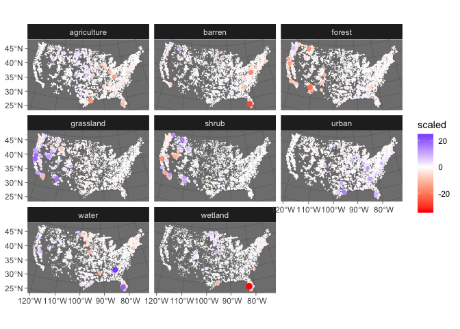

# “USGS Gage Landcover change”

<!-- README.md is generated from README.Rmd. Please edit that file -->

## Process

For all GAGES-II basins in CONUS (n = \~9,000), identify the change in
Anderson Level 1 land cover classes between 2001 and 2019 using the
NLCD.

## Data Directory:

-   parquet file of basins

``` r
basins = sfarrow::st_read_parquet('data/usgs-lc-basins.parquet') 
ref = basins %>% 
  sf::st_centroid() %>% 
  select(GAGE_ID)
```

-   Meta data about all USGS stations was aggregated and stored in CSV
    files.

``` r
file = list.files("./data/", pattern = "sites_", full.names = TRUE)
meta = bind_rows(lapply(file, read.csv)) %>% 
   mutate(GAGE_ID = sprintf("%08s", GAGE_ID), X = NULL)
```

-   Outputs were chunked as well and saved as a series of CSV files.

``` r
file = list.files("./data/", pattern = "output_", full.names = TRUE)

results =  bind_rows(lapply(file, read.csv)) %>% 
     mutate(GAGE_ID = sprintf("%08s", GAGE_ID), X = NULL) %>% 
  right_join(ref) %>% 
  st_as_sf() %>% 
  na.omit() %>% 
  group_by(description) %>% 
  mutate(scaled = scale(perD)) %>% 
  arrange(abs(scaled)) %>% 
  ungroup()
```

    ## Joining, by = "GAGE_ID"

``` r
ggplot() + 
  geom_sf(data = results, aes(color = scaled, size = abs(scaled)), 
          shape = 16) +
  scale_color_gradient2(low = "red", 
                        high = "blue", 
                        na.value = "transparent") + 
  facet_wrap(~description) + 
  scale_size(range = c(0, 3), guide = 'none') +
  theme_dark()
```

<!-- -->

## Search Basins by Category Example

``` r
results %>% 
  filter(description == 'forest') %>% 
  slice_max(perD, n = 10) %>% 
  st_drop_geometry()
```

    ## # A tibble: 10 × 13
    ##    GAGE_ID  landcover lc2001 lc2019 delta  perD  AREA begin_date end_date  
    ##  * <chr>        <int>  <int>  <int> <int> <dbl> <dbl> <chr>      <chr>     
    ##  1 12020800         4  35845  64744 28899  36.7  69.8 1998-10-15 2021-04-30
    ##  2 09408000         4  24456  35242 10786  23.9  39.9 1964-10-01 2021-08-04
    ##  3 14219000         4 124487 160903 36416  19.4 167.  1922-08-01 2021-08-04
    ##  4 12095000         4 151497 193384 41887  18.2 206.  1949-06-01 2021-08-04
    ##  5 12076800         4  77580 107597 30017  17.3 155.  2004-10-01 2021-08-04
    ##  6 12013500         4 223073 283431 60358  16.0 338.  1947-08-26 2021-08-04
    ##  7 01409000         4  67680  91326 23646  15.3 138.  1932-07-07 2012-04-30
    ##  8 01021480         4  56447  69493 13046  15.1  76.7 1998-07-31 2021-08-04
    ##  9 14236200         4 272237 332579 60342  15.0 361.  1956-10-01 2021-08-04
    ## 10 14216500         4 254925 309842 54917  14.1 350.  1927-10-01 2021-08-04
    ## # … with 4 more variables: forcing_years <dbl>, lc_years <dbl>,
    ## #   description <chr>, scaled <dbl[,1]>

# Working with this data:

``` r
paint::paint(read.csv("output/results.csv"))
```

    ## data.frame [51555, 14] 
    ## GAGE_ID       dbl 1011000 1011000 1011000 1011000 1011000 1~
    ## landcover     int 1 2 3 4 5 7
    ## lc2001        int 146973 57213 7802 2695998 297816 122455
    ## lc2019        int 148162 57269 2144 2919741 104664 98781
    ## delta         int 1189 56 -5658 223743 -193152 -23674
    ## perD          dbl 0.034 0.002 -0.159 6.304 -5.442 -0.667
    ## AREA          dbl 3186.8343 3186.8343 3186.8343 3186.8343 3~
    ## begin_date    chr 1910-07-01 1910-07-01 1910-07-01 1910-07-~
    ## end_date      chr 2021-08-04 2021-08-04 2021-08-04 2021-08-~
    ## forcing_years dbl 40 40 40 40 40 40
    ## lc_years      dbl 19 19 19 19 19 19
    ## description   chr water urban barren forest shrub grassland
    ## X             dbl 2024152.84423 2024152.84423 2024152.84423~
    ## Y             dbl 2915840.743314 2915840.743314 2915840.743~
